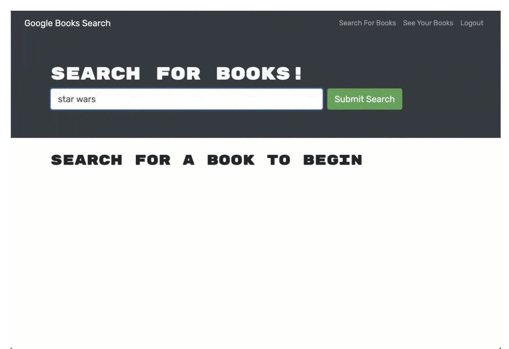

# Book Search

## Description 
This is a book seach website where you can add add and delete books in your collection. It has been created using react, apollo and graphql!  

## Table of Contents

* [Installation](#installation)
* [Usage](#usage)
* [Contributing](#contributing)
* [Tests](#tests)

## Installation
This application requries node, apollo and graphql installions. Run an npm install in the root, client and server folder. 

## Usage 
Deployed Link: https://enigmatic-coast-62136.herokuapp.com/

## Contributing
Please refer to this link:https://www.contributor-covenant.org/
    
## Tests
There are no test instructions at this moment. 

## Questions
Github: www.github.com/stephgeorge22
Email: stephanie.george22@gmail.com

